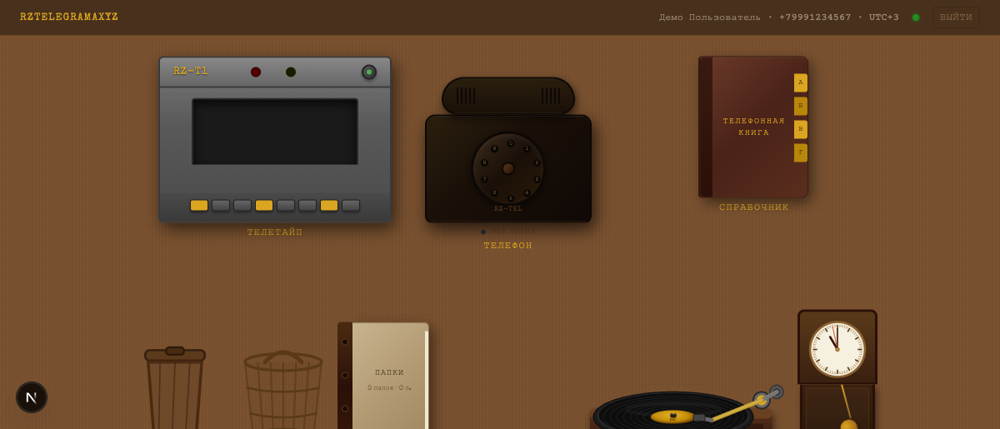
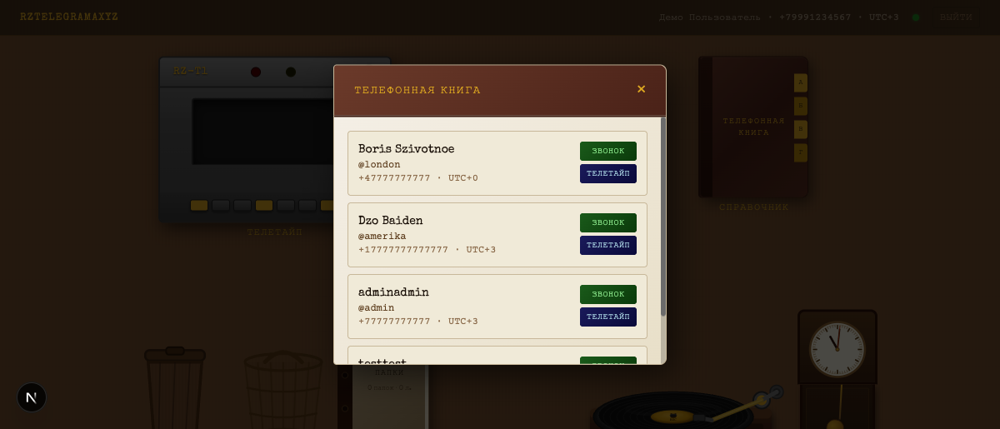
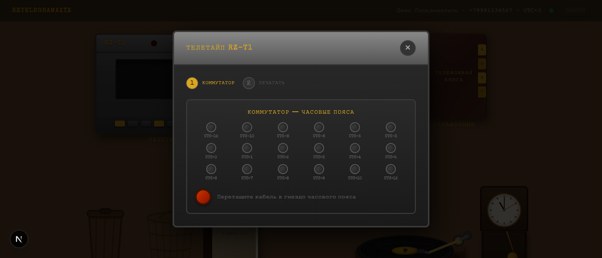
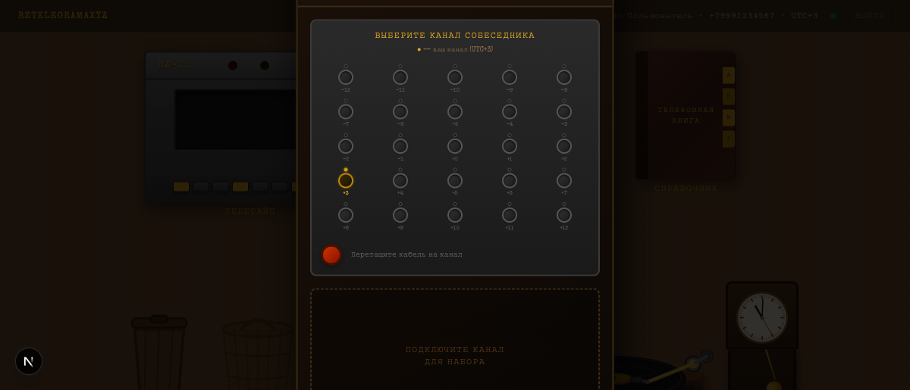
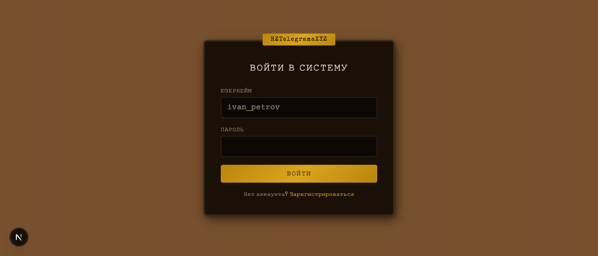
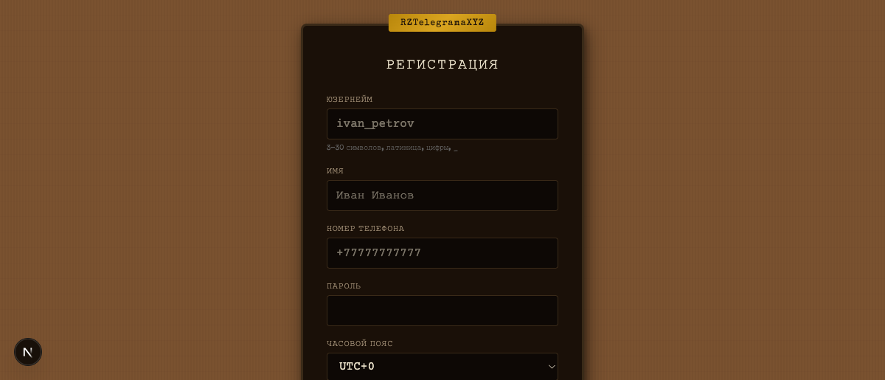

# RZTelegrama

Ретро-мессенджер в стиле 1970x: телетайп, дисковый телефон, коммутатор, папки. E2EE, WebRTC звонки, realtime Socket.io.

#️⃣ `retro` `messenger` `e2ee` `webrtc` `next.js` `typescript` `socket.io` `prisma` `postgresql`

> **Лицензия:** проприетарная, source-available. Код открыт только для просмотра.
> Любое копирование, модификация, запуск и использование для обучения моделей —
> запрещены. См. [LICENSE](./LICENSE).

---

## Скриншоты

| Рабочий стол | Телефонная книга |
|---|---|
|  |  |

| Телетайп — коммутатор | Телефон — выбор канала |
|---|---|
|  |  |

| Вход в систему | Регистрация |
|---|---|
|  |  |

---

## Возможности

- **Аутентификация** — юзернейм + пароль, bcrypt-хэши, JWT-сессии (NextAuth).
- **Сквозное шифрование (E2EE)** — X25519 + XSalsa20-Poly1305 (tweetnacl). Приватный
  ключ шифруется паролем через PBKDF2-SHA256 и хранится только в зашифрованном виде.
- **6 линий связи** — каждому абоненту случайно выдаётся линия 1..6 при регистрации;
  для звонка нужно подключить кабель к нужной линии собеседника на коммутаторе.
- **Телетайп** — отправка и приём сообщений с анимацией «вылезающей ленты».
- **Дисковый телефон + WebRTC** — аудиозвонки peer-to-peer через Socket.io-сигналинг,
  диск можно крутить пальцем на мобайле.
- **Папки** — бумажки с сообщениями раскладываются по папкам drag-and-drop.
- **Три книги** — справочник всех абонентов, личная книга контактов
  (отметка красным карандашом), книга ботов.
- **Профиль** — имя, описание (до 50 символов), часовой пояс, линия.
- **Боты** — REST API + Python-либа, plaintext-сообщения через служебный
  коммутатор (линии 0–6). См. [bot-lib/README.md](./bot-lib/README.md).
- **Граммофон** — встроенный плеер с динамическим списком треков из
  `public/music/` (имя файла = название); на мобайле постоянный мини-бар
  над навигацией.
- **PWA + Web Push** — установка на телефон, push-уведомления через VAPID,
  обработка ротации подписки на Android.

## Стек

| Слой           | Технология                            |
| -------------- | ------------------------------------- |
| Frontend / SSR | Next.js 15 (App Router), React 18     |
| Стили          | Tailwind CSS 4 + Framer Motion        |
| ORM / БД       | Prisma + PostgreSQL 16                |
| Auth           | NextAuth.js (credentials)             |
| Realtime       | Socket.io поверх кастомного `server.js` |
| WebRTC         | simple-peer                           |
| Crypto         | tweetnacl, Web Crypto API (PBKDF2)    |

---

## Запуск для ознакомления

Запуск кода лицензией **не разрешён**; инструкции ниже приведены только для
понимания структуры проекта.

```bash
cp .env.example .env         # заполнить значения
docker compose up -d         # PostgreSQL
npx prisma migrate deploy
npm install
npm run dev                  # http://localhost:3000
```

### Обязательные переменные окружения

См. [.env.example](./.env.example):

- `DATABASE_URL` — строка подключения к PostgreSQL.
- `NEXTAUTH_SECRET` — случайная строка ≥ 32 байт (`openssl rand -base64 32`).
- `NEXTAUTH_URL` — публичный URL приложения.
- `POSTGRES_USER`, `POSTGRES_PASSWORD`, `POSTGRES_DB` — для docker-compose.

### Опциональные переменные

- `VAPID_PUBLIC_KEY`, `VAPID_PRIVATE_KEY`, `VAPID_SUBJECT` — Web Push
  (`npx web-push generate-vapid-keys`). Без них push-уведомления отключены.
- `INTERNAL_HOOK_SECRET` — **обязательно в production**, чтобы сообщения от
  ботов сразу прилетали на телетайп через Socket.io. Любая случайная строка;
  в dev можно опустить — hook принимается без проверки.
- `ADMIN_USERNAMES` — список юзернеймов через запятую. Только эти
  пользователи могут создавать ботов на служебной линии 0; остальным
  ботам выдаётся случайная линия 1..6.
- `SOCKET_CORS_ORIGIN` — публичный origin для Socket.io в production.
- `TURN_URL`, `TURN_USERNAME`, `TURN_CREDENTIAL` — для звонков за NAT.

---

## Деплой в production

Стандартный pipeline (PM2 + Postgres на одном хосте):

```bash
git pull
npx prisma migrate deploy   # применить новые миграции
npm run build                # включает prisma generate
pm2 restart 0                # 0 — id процесса rztelegrama
```

Перед первым деплоем выставить env (`.env` или менеджер секретов pm2):

```
DATABASE_URL=postgres://...
NEXTAUTH_SECRET=...
NEXTAUTH_URL=https://your-host.example
VAPID_PUBLIC_KEY=...
VAPID_PRIVATE_KEY=...
INTERNAL_HOOK_SECRET=$(openssl rand -base64 32)
ADMIN_USERNAMES=rudolf
```

---

## Структура

```
app/
  (auth)/          # login / register
  api/             # REST: users, messages, folders, contacts, bots,
                   #       bot/getUpdates, bot/sendMessage, push, music, me
  desk/            # главный интерфейс (стол) — desktop + mobile варианты
components/
  teletype/        # телетайп, коммутатор (regular 1..6 / service 0..6)
  phone/           # дисковый телефон, диск набора, модалка звонка
  phonebook/       # книга — variants: all / saved / bots
  folder/          # папки и бумажки
  desk/            # часы, корзина, плеер, недозвоны, DraggableSlot
  bots/            # BotManager (создание/токены/удаление)
  mobile/          # мобильные вкладки, мини-плеер, нижняя навигация
lib/
  auth.ts          # NextAuth options
  botAuth.ts       # резолв токена бота из Authorization header
  crypto.ts        # E2EE: keygen, encrypt, decrypt, PBKDF2
  prisma.ts        # Prisma singleton
  socket.ts        # Socket.io client
  useWebRTC.ts     # хук WebRTC-звонков
  push.ts          # Web Push регистрация (VAPID, gesture-prompt)
prisma/
  schema.prisma    # User (с isBot/botOwnerId), Message, Folder, Contact,
                   # PushSubscription, BotToken
bot-lib/
  python/          # Python long-poll клиент для написания ботов
  README.md        # архитектура и API ботов
public/
  sw.js            # service worker (push, pushsubscriptionchange)
  music/           # положите сюда .mp3 — появятся в граммофоне
server.js          # кастомный Next.js + Socket.io сервер + bot hook
```

---

## Безопасность

- Приватные ключи пользователей **никогда** не видны серверу в открытом виде.
- Сервер хранит только зашифрованный `encryptedPrivateKey` + `nonce` + `salt`.
- Сообщения в БД — зашифрованные блобы (`content` + `nonce`), сервер не читает.
- Пароли хэшируются bcrypt (10 раундов).
- Все REST-эндпоинты защищены сессией; WebSocket-события привязаны к
  авторизованному `socket.data.userId`.

---

## Лицензия

Copyright © 2026 Rudolf1517. Все права защищены.

Этот репозиторий распространяется под лицензией **PolyForm Strict 1.0.0**.
Полный текст — в файле [LICENSE](./LICENSE).

Коротко: разрешён просмотр и личное некоммерческое изучение.
Запрещены: распространение, модификация, коммерческое использование, запуск в production.
Для любого другого использования — обращайтесь к правообладателю.
